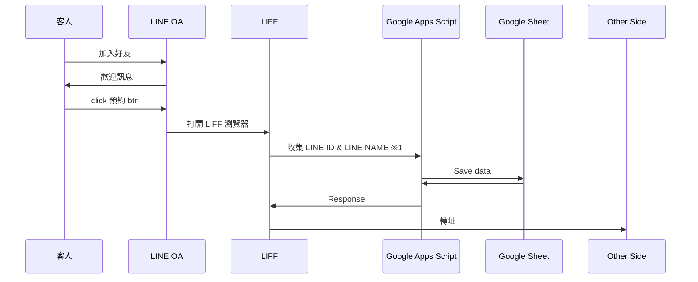
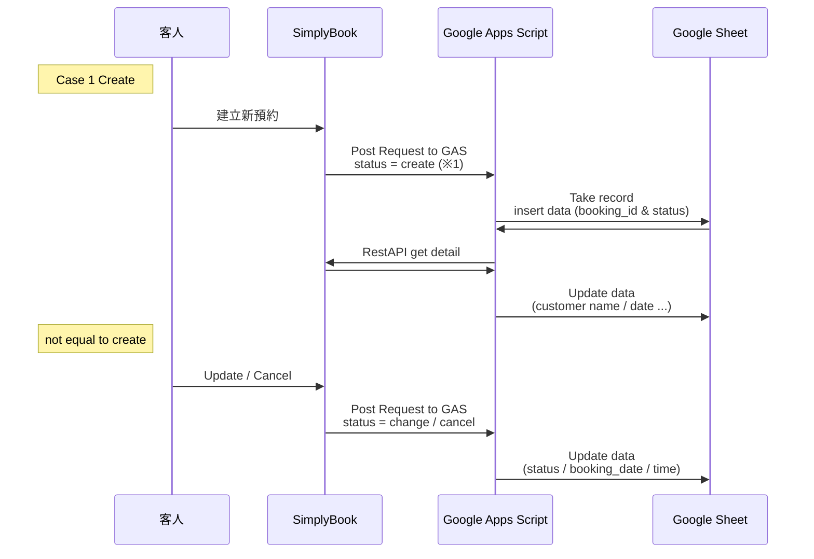

# Clasp Gas LIFF

## 專案目的：

* 搭配 Siyplybook 預約系統 / LINE OA / Google Apps Script
* 加上 CRM 客戶明細表
* 最終想打造 預約 & LINE 預約 & LINE 流量池經營 & LINE Message API 傳訊息給客戶 & 提醒預約…等功能

## 流程

### LINE OA & LIFF 使用情景

#### ※ 1
LIFF 中繼，使用 Github Page 當做中轉站

例：三種尺寸的 html
https://liff.github.io/tall
https://liff.github.io/full
https://liff.github.io/compact

GET 參數

https://liff.github.io/{size}?goto={redirect_url}

goto 要轉址到的 url

### Simplybook Webhook 通知

#### ※1

Can get booking_id / booking_hash / status

### Google Apps Script

## Todo

- Google Apps Script
  - [ ] doPost API
  - [ ] LIFF save to log sheet
  - [ ] Simplybook create
    - [ ] Save log
    - [ ] Save data to Google Sheet
    - [ ] Use booking_id to request detail info
    - [ ] Update google calendar content
  - [ ] Simplybook others
    - [ ] Save log
    - [ ] Use booking id to find row number
    - [ ] Edit it
- LIFF
  - [ ] LIFF html css
  - [ ] LIFF javascript code
    - [ ] If isLogined is false then exexute `LIFF.login()`
    - [ ] getLineToken `LIFF.getDecodedIDToken()`
    - [ ] send request to google apps script
    - [ ] redirect to url from url pramas goto
- Others
  - [ ] deploy
  - [ ] Register LIFF URL