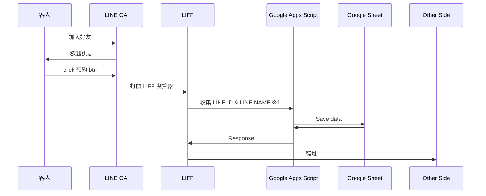
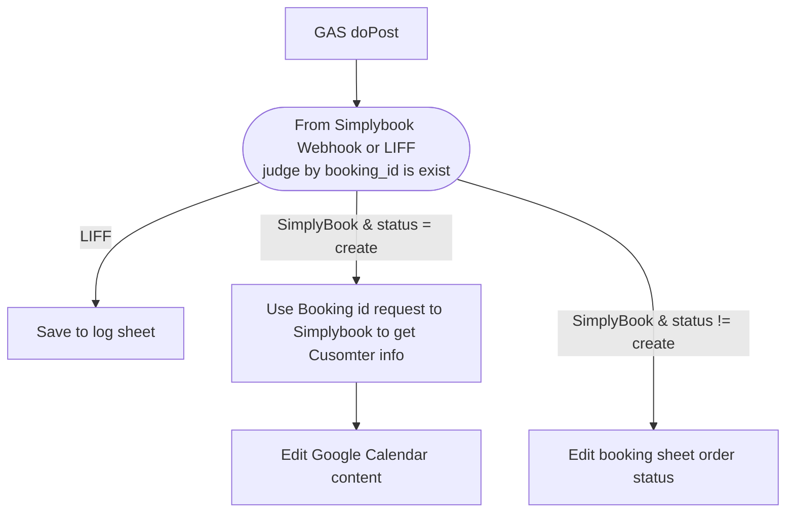

# Booking Gas LIFF

## 專案目的：

* 搭配 Simplybook 預約系統 / LINE OA / Google Apps Script
* 加上 CRM 客戶明細表
* 最終想打造 預約 & LINE 預約 & LINE CRM & LINE Message API 傳訊息給客戶 & 提醒預約…等功能

## 為何要寫code

* 透過 SimplyBook 可以在 LINE OA 開啟 LIFF，進行預約
* 但我想要得到消費者 LINE 的 ID，但 Simplybook 的 API / 後台，都沒有給資料
* 為了想要進行提醒 & 再行銷
  * 例如：付款完成 (Trigger: 還不知道)
  * 例如：預約日期的前一天提醒 (Trigger: crontab)
  * 例如：兩個月後自動發送問卷 (Trigger: crontab)
  * 例如：寫完問卷自動發動優惠卷 (Trigger: Google Form submit)
* 因此需要想方設法取得 LINE ID
* 需要
  * 下方第一點：跳轉頁面用的 LIFF (取得 LINE ID)
  * 下方第二點：收集 LINE ID 的 DB / API ...

## 流程

### 1. LINE OA & LIFF 使用情景

#### ※ 1
* LIFF，使用 Github Page 當做中轉站
* 共有三種尺寸的 html
  * 例：https://liff.github.io/tall
  * 例：https://liff.github.io/full
  * 例：https://liff.github.io/compact
* 網址參數
  * goto 要轉址到的 url
  * 例：https://liff.github.io/{size}?goto={redirect_url}

### Simplybook Webhook 通知

### Google Apps Script

## Todo

- Google Apps Script
  - [X] doPost API
  - [X] Save log
  - Simplybook
    - [X] Use simplybook api to get booking detail
    - [X] When Create booking
      - [X] Save data to Google Sheet
      - [ ] Update google calendar content
    - [X] Simplybook others status (update / cancel / new_client...)
      - [X] Use booking id to find row number
      - [X] Update it
  - LIFF
    - [X] Take record
    - [ ] If LINE ID is a new, then Save LINE ID and LINE Name to Google Sheet
    - [ ] else if LIND ID is exist and LINE Name has updated, then Update LINE Name to Google sheet
    - [ ] else (have same LINE ID) then ignore it
  - Send LINE Message or Email
    - [ ] 預約成功 - 發送 LINE 訊息
    - [ ] 收款成功 - 發送 LINE 訊息 & Google Meet 連結
    - [ ] 更新成功 - 發送 LINE 訊息
    - [ ] 取消成功 - 發送 LINE 訊息，跟客戶要 ATM 號碼，手工退款
- LIFF
  - [X] LIFF html css
  - [X] LIFF javascript code
    - [X] If isLogined is false then exexute `LIFF.login()`
    - [X] getLineToken `LIFF.getDecodedIDToken()`
    - [X] send request to google apps script
    - [X] redirect to url from url pramas goto
- Others
  - [X] deploy LIFF html page
  - [X] deploy Google Apps Script
  - [X] Register LIFF URL

## 關於我

* LINE 官方帳號： https://line.me/R/ti/p/@632lptka
* Instagram： https://www.instagram.com/akashic.tommy/